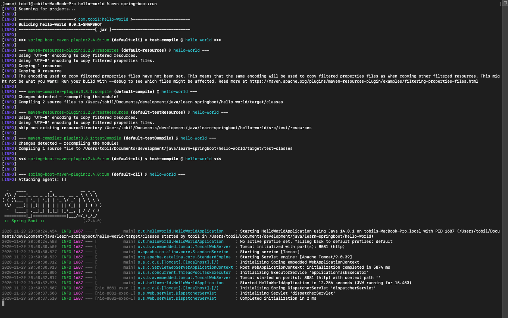
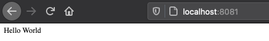

# Hello World

[List-of-content](../README.md)

---

## config

```bash
# change file application.properties
server.port=8081

# run maven
mvn spring-boot:run

# open localhost:8081
# open localhost:8081/hello-world
```
- controller
  ```
    buat package baru bernama controller kemudian tambahkan kelas Controller.java
  ```
  ```java
  package com.tobil.helloworld.controller;
  
  
  import org.springframework.web.bind.annotation.GetMapping;
  import org.springframework.web.bind.annotation.RestController;
  
  @RestController
  public class Controller {
  
      @GetMapping("/")
      public String helloBuddy(){
          return "Hei buddy";
      }
  
      @GetMapping("/hello-world")
      public String helloWolrd(){
          return "hello world from patah hello-world";
      }
  
  }

  ```

## output


