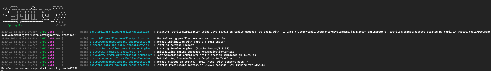

# Spring Profile

Untuk binding profile kita dapat menggunakan beans dengan profile yang berbeda

[List of content](../README.md)

## Config
- application.properties
    ```properties
    spring.profiles.active=production
    server.port=8081
    ```
- application-development.properties
    ```properties
    msg=Hello from development properties
    ```
- application-production.properties
    ```properties
    msg=Hello from production properties
    ```
- application.yml
    ```yaml
    environments:
      development:
        url: http://dev.bar.com
        name: development Set up
      production:
        url: http://foo.bar.com
        name: production set up
    ```
- DataSource.java
    ```java
      package com.tobil.profiles;
      
      public class DataSource {
          private String server;
          private int port;
      
          public DataSource(){}
      
          public DataSource(String server, int port) {
              this.server = server;
              this.port = port;
          }
      
          public String getServer() {
              return server;
          }
      
          public void setServer(String server) {
              this.server = server;
          }
      
          public int getPort() {
              return port;
          }
      
          public void setPort(int port) {
              this.port = port;
          }
      
          @Override
          public String toString() {
              return "DataSources{" +
                      "server'" + server + '\'' +
                      ", port=" + port +
                      '}';
          }
      }
    ```
- DataSourceConfig.java
    ```java
    package com.tobil.profiles;
    
    
    import org.springframework.context.annotation.Bean;
    import org.springframework.context.annotation.Configuration;
    import org.springframework.context.annotation.Profile;
    
    @Configuration
    public class DataSourceConfig {
    
        @Bean(name = "datasource")
        @Profile("development")
        DataSource dveelopment() {
            return new DataSource("my-development-url", 9999);
        }
    
        @Bean(name = "datasource")
        @Profile("production")
        DataSource production() {
            return new DataSource("my-production-url", 9999);
        }
    }
    ```
- PageController.java
    ```java
      package com.tobil.profiles;
      
      import org.springframework.beans.factory.annotation.Value;
      import org.springframework.web.bind.annotation.GetMapping;
      import org.springframework.web.bind.annotation.RestController;
      
      @RestController
      public class PageController {
      
          @Value("${spring.profiles.active}")
          private String environment;
      
          @Value("${msg}")
          private String msg;
      
          @GetMapping("/msg")
          public String message() {
              return msg;
          }
      
          @GetMapping("/")
          public String home() {
              return environment;
          }
      }
    ```
- ProfilesApplication.java
    ```java 
      package com.tobil.profiles;
      
      import org.springframework.boot.SpringApplication;
      import org.springframework.boot.autoconfigure.SpringBootApplication;
      import org.springframework.context.ApplicationContext;
      
      @SpringBootApplication
      public class ProfilesApplication {
      
      
        public static void main(String[] args) {
      
            ApplicationContext ctx = SpringApplication.run(ProfilesApplication.class, args);
            System.out.println(ctx.getBean("datasource").toString());
      
        }
      
      }
    ```
  
- output
 
